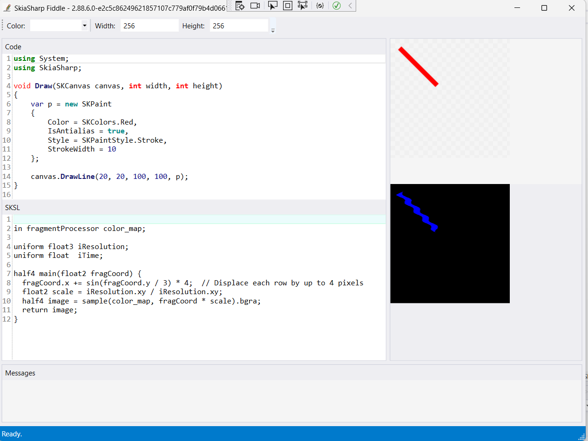

# SkiaSharp Fiddle

A SkiaSharp playground - just like https://fiddle.skia.org, but for your own machine!

This little app is made using some really awesome open source libraries:

 - [SkiaSharp](https://github.com/mono/SkiaSharp) as the drawing library
 - [AvalonEdit](https://github.com/icsharpcode/AvalonEdit) as the code editor
 - [Roslyn .NET Compiler](https://github.com/dotnet/roslyn) as the code compiler
 - [Windows Presentation Foundation (WPF)](https://github.com/dotnet/wpf) as the UI framework

For macOS, there is a port to Xamarin.Forms available.

